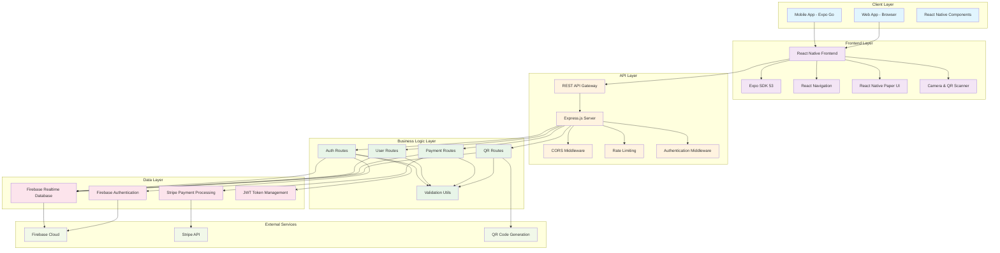

# NamPay System Architecture

## Overview

NamPay is a modern QR-based money transfer application built with React Native (Expo) frontend and Node.js/Express backend. The system enables users to generate QR codes for payment requests and scan QR codes to make payments, with real-time transaction processing and secure authentication.

## System Architecture Diagram



## System Components

### 1. Client Layer
- **Mobile App (Expo Go)**: Cross-platform mobile application
- **Web App**: Browser-based web application
- **React Native Components**: Reusable UI components

### 2. Frontend Layer
- **React Native Frontend**: Cross-platform mobile development framework
- **Expo SDK 53**: Development platform and tools
- **React Navigation**: Navigation library for React Native
- **React Native Paper**: Material Design components
- **Camera & QR Scanner**: expo-camera for QR code scanning

### 3. API Layer
- **REST API Gateway**: Express.js server handling HTTP requests
- **CORS Middleware**: Cross-origin resource sharing configuration
- **Rate Limiting**: Request throttling for security
- **Authentication Middleware**: JWT token validation

### 4. Business Logic Layer
- **Auth Routes**: User authentication and authorization
- **User Routes**: User profile and transaction management
- **Payment Routes**: Payment processing and card management
- **QR Routes**: QR code generation and scanning
- **Validation Utils**: Input validation and sanitization

### 5. Data Layer
- **Firebase Realtime Database**: Real-time data storage
- **Firebase Authentication**: User authentication service
- **Stripe Payment Processing**: Payment gateway integration
- **JWT Token Management**: Secure token handling

### 6. External Services
- **Firebase Cloud**: Backend-as-a-Service platform
- **Stripe API**: Payment processing service
- **QR Code Generation**: QR code creation library

## Technology Stack

### Frontend Technologies
- **React Native**: 0.79.5
- **Expo**: 53.0.22
- **React**: 19.0.0
- **React Navigation**: 6.x
- **React Native Paper**: 5.12.3
- **expo-camera**: 16.1.11
- **expo-linear-gradient**: 14.1.5
- **Axios**: 1.7.2

### Backend Technologies
- **Node.js**: Runtime environment
- **Express.js**: 4.18.2
- **Firebase Admin SDK**: 13.5.0
- **JWT**: 9.0.2
- **Stripe**: 13.5.0
- **QRCode**: 1.5.4
- **bcryptjs**: 2.4.3
- **express-rate-limit**: 6.7.0

### Database & Services
- **Firebase Realtime Database**: NoSQL database
- **Firebase Authentication**: User management
- **Stripe**: Payment processing
- **JWT**: Token-based authentication

## Data Flow

### 1. User Authentication Flow
```
User Login → Frontend → API Gateway → Auth Routes → Firebase Auth → JWT Token → Response
```

### 2. QR Code Generation Flow
```
Generate Request → Frontend → API Gateway → QR Routes → QR Code Generation → Database Storage → Response
```

### 3. QR Code Scanning Flow
```
Scan QR Code → Camera → Frontend → API Gateway → QR Routes → Database Query → Payment Processing → Response
```

### 4. Payment Processing Flow
```
Payment Request → Frontend → API Gateway → Payment Routes → Stripe API → Database Update → Response
```

## Security Features

### 1. Authentication & Authorization
- JWT token-based authentication
- Firebase Authentication integration
- Token expiration and refresh
- Secure password hashing with bcryptjs

### 2. API Security
- Rate limiting (100 requests per 15 minutes)
- CORS configuration
- Helmet security headers
- Input validation and sanitization

### 3. Data Protection
- Encrypted data transmission (HTTPS)
- Secure Firebase rules
- Stripe PCI compliance
- Environment variable protection

## Deployment Architecture

### Development Environment
- **Frontend**: Expo development server (localhost:19006)
- **Backend**: Node.js server (localhost:3000)
- **Database**: Firebase development project
- **Payment**: Stripe test environment

### Production Environment
- **Frontend**: Expo web build or mobile app stores
- **Backend**: Cloud hosting (Heroku, AWS, etc.)
- **Database**: Firebase production project
- **Payment**: Stripe live environment

## API Endpoints

### Authentication Endpoints
- `POST /api/auth/login` - User login
- `POST /api/auth/register` - User registration
- `POST /api/auth/logout` - User logout
- `GET /api/auth/verify` - Token verification

### User Endpoints
- `GET /api/users/profile` - Get user profile
- `PUT /api/users/profile` - Update user profile
- `GET /api/users/transactions` - Get user transactions
- `GET /api/users/balance` - Get user balance
- `GET /api/users/stats` - Get user statistics

### Payment Endpoints
- `GET /api/payments/cards` - Get user cards
- `POST /api/payments/cards` - Add payment card
- `DELETE /api/payments/cards/:id` - Remove payment card
- `POST /api/payments/process` - Process payment
- `GET /api/payments/history` - Get payment history

### QR Endpoints
- `POST /api/qr/generate` - Generate QR code
- `POST /api/qr/scan` - Scan QR code
- `GET /api/qr/history` - Get QR history

## Performance Considerations

### 1. Frontend Optimization
- React Native performance optimizations
- Image optimization and caching
- Lazy loading of components
- Efficient state management

### 2. Backend Optimization
- Database query optimization
- Caching strategies
- Rate limiting
- Connection pooling

### 3. Network Optimization
- API response compression
- Efficient data serialization
- Offline capability
- Progressive web app features

## Scalability Features

### 1. Horizontal Scaling
- Stateless API design
- Load balancer compatibility
- Database sharding support
- Microservices architecture ready

### 2. Vertical Scaling
- Efficient resource utilization
- Memory management
- CPU optimization
- Storage optimization

## Monitoring & Logging

### 1. Application Monitoring
- Error tracking and reporting
- Performance metrics
- User analytics
- API usage monitoring

### 2. Security Monitoring
- Authentication logs
- Payment transaction logs
- Security event tracking
- Compliance reporting

## Future Enhancements

### 1. Planned Features
- Push notifications
- Biometric authentication
- Multi-currency support
- Advanced analytics dashboard

### 2. Technical Improvements
- GraphQL API implementation
- Real-time WebSocket connections
- Advanced caching strategies
- Machine learning integration

---

*This document provides a comprehensive overview of the NamPay system architecture. For detailed implementation guides, refer to the individual component documentation.*
